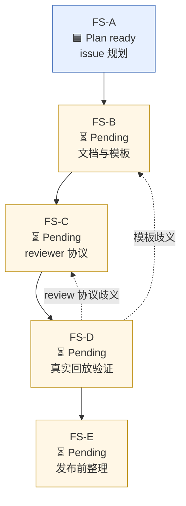

# Issue Planning Template

Use this when creating or reviewing the planning issue for a workflow task.

## Recommended Sections

````md
## 背景

## 目标

## 非目标

## 上游依据

## 计划产物

| 产物 | 说明 | 依赖项 | 验收方式 | 完成状态 |
|---|---|---|---|---|

## 工作流

## 阶段表

| 阶段 | 目标 | 主要改动 | 依赖项 | 准出标准 | 完成状态 |
|---|---|---|---|---|---|
| FS-A | issue 规划 ready | 修订本 issue | 无 | reviewer C/I=0；等待 maintainer 接管 | 🟦 Plan ready |
| FS-B | 文档与模板第一版 | 完善 SKILL.md 与 references | FS-A | 模板和引用清单对齐 | ⏳ Pending |

状态口径：

| 状态 | 含义 |
|---|---|
| 🟦 Plan ready | 计划已通过 review，可进入下一阶段 |
| ⏳ Pending | 未开工或等待依赖 |
| 🚧 In progress | 正在实现、review 或修复 |
| ✅ Done | 已完成且证据已回填 |
| ⛔ Blocked | 有明确阻塞原因和恢复条件 |

## Sub PR 拆分建议

| ID | 完成状态 | 主要目标 | 依赖项 | 可并行窗口 | 主要冲突面 | 必过验收 |
|---|---|---|---|---|---|---|

## 依赖图（只画实施阶段）



> Mermaid 只画实施阶段。模板文件、reviewer pool、CI/Codecov 等应写入表格和准出标准，避免把 artifact 当成依赖节点。

## Reviewer 协议

## Reviewer Pool Discovery

| reviewer | executor / mechanism | detected by | role | status |
|---|---|---|---|---|

## 准出标准

## 当前状态
````

## Readiness Checks

- The issue clearly says what is being built.
- The issue says what is intentionally out of scope.
- The issue has enough information to draft an empty PR body.
- The issue has a C/I/M review plan.
- The issue says who merges or does not merge.
- Phase and sub PR tables include dependency columns.
- Status columns use emoji plus short text, not ambiguous prose alone.
- Mermaid graphs contain implementation phases only.
