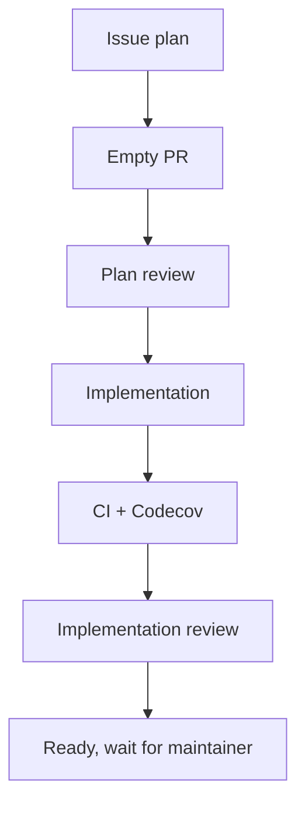

# Issue Planning Template

Use this when creating or reviewing the planning issue for a workflow task.

## Recommended Sections

````md
## 背景

## 目标

## 非目标

## 上游依据

## 计划产物

| 产物 | 说明 | 验收方式 |
|---|---|---|

## 工作流

## Sub PR 拆分建议

| PR | 目标 | 依赖 | 产物 | 准出标准 | 状态 |
|---|---|---|---|---|---|

## 依赖图



## Reviewer 协议

## 准出标准

## 当前状态
````

## Readiness Checks

- The issue clearly says what is being built.
- The issue says what is intentionally out of scope.
- The issue has enough information to draft an empty PR body.
- The issue has a C/I/M review plan.
- The issue says who merges or does not merge.
