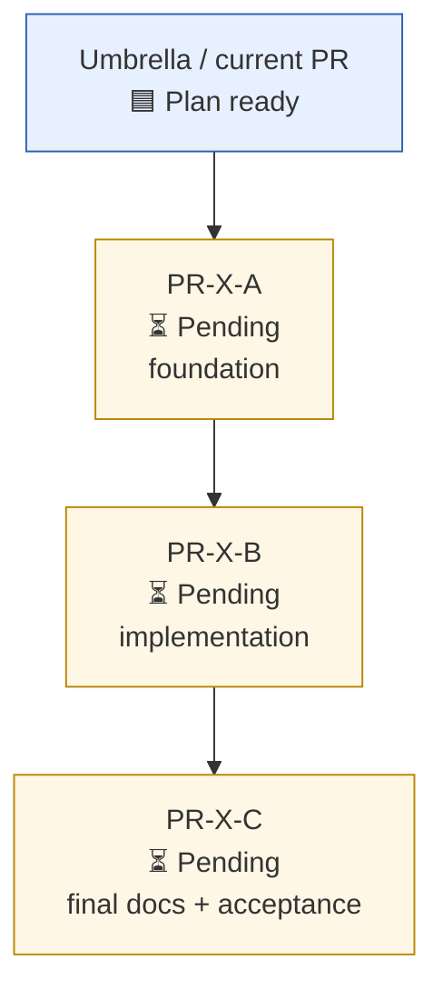

# PR Body Template

Use this when creating an empty contract-first pull request. The PR body is the executable contract for the next agent or reviewer.

Set the PR type explicitly:

- `umbrella`: plan and integration branch for several leaf PRs;
- `leaf`: scoped implementation PR based on an umbrella branch;
- `single`: one self-contained PR with no sub PR split.

````md
## PR 定位

| 字段 | 值 |
|---|---|
| PR 类型 | umbrella / leaf / single |
| 当前阶段 | 🟦 Plan ready / ⏳ Pending / 🚧 In progress / ✅ Done / ⛔ Blocked |
| base / head | `<base>` -> `<head>` |
| 是否允许直接 merge | 否，除非 maintainer 明确指示 |

## 上游依据

- Issue:
- Umbrella PR:
- Related PRs:

## 当前状态

| 项目 | 依赖项 | 完成状态 | 说明 |
|---|---|---|---|
| Empty PR contract | 上游 issue / umbrella | 🟦 Plan ready | body 可执行后才能进入 TDD |
| Plan review | reviewer pool discovery | ⏳ Pending | C/I=0 后进入实现 |

## 目标

## 范围

### 可以修改

| 路径 / 模块 | 目的 |
|---|---|

### 不应修改

| 路径 / 模块 | 原因 |
|---|---|

## Sub PR 拆分（umbrella PR 使用）

| ID | 完成状态 | 建议标题 / branch slug | 主要目标 | 依赖项 | 可并行窗口 | 主要冲突面 | 必过验收 | 验证 / 慢测策略 |
|---|---|---|---|---|---|---|---|---|

## Leaf PR 合同（leaf PR 使用）

| 字段 | 内容 |
|---|---|
| 所属 umbrella | |
| leaf ID | |
| 依赖项 | |
| merge 回填要求 | 更新 umbrella body + 新增 umbrella comment |
| 禁止越界 | |
| 完整 leaf 字段集 | 以 `references/sub-pr-planning.md` 的 Leaf PR Body Minimum 为准 |

## Reviewer Challenge

列出本 leaf 或当前 PR 最容易出错的具体点。实现阶段 reviewer 应围绕这些点构造反例或复现命令。

## 依赖图（只画实施阶段）



> Mermaid 只包含 implementation phases / leaf PRs。Reviewer discovery、templates、CI、Codecov 等放在表格或 gate 中，不作为 DAG 节点，除非它们本身就是一个实施阶段。

## 测试与验证计划

| Gate | 命令 | 何时运行 | 预期 |
|---|---|---|---|
| focused tests | | TDD / 修复后 | pass |
| fast full gate | | ready 前 | pass |
| slow tests | | 只有触及慢测风险面时 | pass / 明确不适用 |

## Codecov / CI 策略

| 项目 | 策略 |
|---|---|
| CI | push 后 watch 到所有必需检查通过 |
| Codecov comment | 若出现，按 review 输入处理；modified lines uncovered 需要解释或补测 |
| slow tests | 默认按 repo 约定 skip slow；若 touched runtime / release gate，再升级 |

## Reviewer 协议

## Reviewer Pool

| reviewer | executor / mechanism | detected by | role | status |
|---|---|---|---|---|

## Ready Gate

- [ ] Reviewer pool discovery recorded
- [ ] Plan review C/I = 0
- [ ] For umbrella PR: sub PR table has dependencies and emoji status
- [ ] For umbrella PR: Mermaid graph contains implementation phases only
- [ ] For leaf PR: parent umbrella update/comment contract is written
- [ ] Tests pass
- [ ] CI pass
- [ ] Codecov comment reviewed when available
- [ ] Implementation review C/I = 0
- [ ] PR body updated with final evidence
- [ ] Do not merge until maintainer explicitly instructs

## Leaf Merge-Back Comment（leaf merge 后贴到 umbrella）

> 使用前必须先更新 umbrella PR body：leaf 行改为 `✅ Done`，记录 merge commit，更新依赖解锁 / 阻塞，更新 Mermaid node label/class。然后再贴下面的 umbrella progress comment。

```md
## PR-X-A merge 回填

- 子 PR：<url>
- merge commit：<sha>
- 主要文件：<paths>
- 已跑验证：<commands + pass/fail>
- C/I/M 残留：C=0, I=0, M=<n>；M 级处理/延后原因
- 对下游影响：<依赖解锁 / contract 变化 / 冲突风险>
- 下一步：<可启动或需阻塞的子 PR>
```
````
