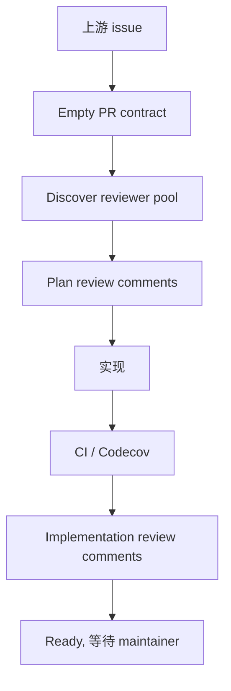

# PR Body Template

Use this when creating an empty contract-first pull request.

````md
## PR 定位

## 上游依据

- Issue:
- Umbrella PR:
- Related PRs:

## 当前状态

| 项目 | 状态 | 说明 |
|---|---|---|

## 目标

## 范围

### 可以修改

| 路径 / 模块 | 目的 |
|---|---|

### 不应修改

| 路径 / 模块 | 原因 |
|---|---|

## Sub PR 拆分

| PR | 目标 | 依赖 | 产物 | 准出标准 | 状态 |
|---|---|---|---|---|---|

## 依赖图



## 测试与验证计划

## Codecov / CI 策略

## Reviewer 协议

## Reviewer Pool

| reviewer | executor / mechanism | detected by | role | status |
|---|---|---|---|---|

## Ready Gate

- [ ] Reviewer pool discovery recorded
- [ ] Plan review C/I = 0
- [ ] Tests pass
- [ ] CI pass
- [ ] Codecov comment reviewed when available
- [ ] Implementation review C/I = 0
- [ ] PR body updated with final evidence
- [ ] Do not merge until maintainer explicitly instructs
````
