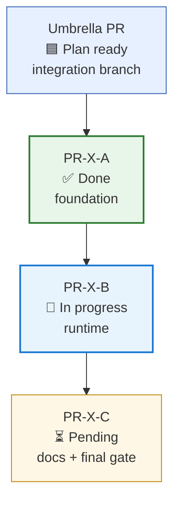

# Sub PR Planning

Use this reference when a GitHub workflow task is too large for one reviewable implementation PR.

Observed source patterns for this repository's initial design include `HansBug/research_ideas#64`, `HansBug/research_ideas#82`, `HansBug/pyfcstm#158`, and its leaf PRs `#159`, `#160`, `#161`, `#164`. Keep the skill generic; cite these only as examples of the process shape.

## When To Split

Prefer an umbrella plus leaf PRs when any of these are true:

- one PR would mix unrelated conflict surfaces, such as parser/model/runtime/docs;
- reviewers need different challenge lists for different slices;
- some work can proceed in parallel after a shared base lands;
- a plan needs a durable progress ledger across many sessions;
- implementation should not begin until an empty plan PR is reviewed and accepted.

Keep a single PR when the change is small, has one conflict surface, and can be reviewed end to end without a separate progress ledger.

## Umbrella PR

An umbrella PR is a planning and integration branch.

- Its base is the upstream target branch or upstream parent PR branch.
- Its head is the integration branch for the whole task.
- It should start as an empty or plan-only PR.
- It owns the sub PR table, dependency DAG, reviewer challenge list, and progress comments.
- It should not merge to the final upstream target until all required leaf PRs are done and final integration review has C/I = 0.
- It may receive merge commits from leaf PRs; it should not quietly absorb unrelated implementation outside the planned integration role.

## Leaf PR

A leaf PR is one reviewable implementation slice under an umbrella.

- Its base is the umbrella branch.
- Its body must name the umbrella PR, upstream issue, leaf ID, scope, dependencies, forbidden paths, validation commands, and merge-back contract.
- It must pass plan review before TDD or implementation work begins.
- It must pass implementation review, CI, and Codecov review when applicable before merge back to the umbrella branch.
- It must not expand across conflict surfaces without first updating its own body and the umbrella plan.

## Status Legend

Use short status text with an emoji. Avoid bare colors without text.

| 状态 | 含义 | 更新规则 |
|---|---|---|
| 🟦 Plan ready | umbrella 或 leaf plan 已通过 C/I review，等待进入下一阶段 | 只说明计划可执行，不说明实现已完成 |
| ⏳ Pending | leaf 尚未创建、未开工或等待依赖 | 默认状态；必须列出依赖项 |
| 🚧 In progress | leaf 已创建，处于实现、CI、review 或修复中 | 开工后更新 umbrella body |
| ✅ Done | leaf 已 merge 回 umbrella，body 与 comment 已回填 | merge 后立即更新 |
| ⛔ Blocked | 被上游、CI、C/I review、冲突或证据缺口阻塞 | 必须写阻塞原因和恢复条件 |

## Umbrella Sub PR Table

Use a table that can be updated after every merge. The dependency column is mandatory.

```md
| ID | 完成状态 | 建议标题 / branch slug | 主要目标 | 依赖项 | 可并行窗口 | 主要冲突面 | 必过验收 | 验证 / 慢测策略 |
|---|---|---|---|---|---|---|---|---|
| PR-X-A | 🟦 Plan ready | `feature-x-foundation` | 建立共享底座 | umbrella plan approved | A 完成后解锁 B/C | `src/core/**`, `tests/core/**` | focused tests + plan review C/I=0 | skip slow unless runtime touched |
| PR-X-B | ⏳ Pending | `feature-x-runtime` | 实现 runtime 语义 | A | 可与 C 部分并行 | `src/runtime/**` | unit + integration + CI + Codecov | run fast full gate; slow only if required |
| PR-X-C | ⏳ Pending | `feature-x-docs-final` | docs 与最终验收 | A+B | B 接近完成后可草拟 | `docs/**`, PR body | final review C/I=0 | docs build / smoke |
```

## Mermaid Dependency Graph

The Mermaid graph should contain implementation phases or leaf PR nodes only. Do not add unrelated artifact nodes such as `SKILL.md`, `reviewer pool`, or `template file`; those belong in tables or checklists.

Use status emojis inside node labels and status-related colors in `classDef`.



## Leaf PR Body Minimum

Each leaf PR body must include:

1. Umbrella PR and upstream issue links.
2. Leaf ID, target branch, base branch, dependency list, and merge-back order.
3. Scope, non-goals, and forbidden path list.
4. Target files or modules mapped to tests.
5. TDD plan and executable validation commands.
6. CI / Codecov expectations and whether slow tests are skipped.
7. Reviewer challenge list for this leaf's real risk surface.
8. Current status and remaining tasks.

## Merge-Back Protocol

After a leaf PR merges into the umbrella branch, the orchestrator must do both updates:

1. Edit the umbrella PR body:
   - mark the leaf as `✅ Done`;
   - record leaf PR number and merge commit;
   - update dependency unlocks or new blockers;
   - update the Mermaid node label/class;
   - update final todo/checklist and validation evidence.
2. Add a new umbrella PR comment with the merge-back summary.

Use this comment shape:

```md
## PR-X-A merge 回填

- 子 PR：<url>
- merge commit：<sha>
- 主要文件：<paths>
- 已跑验证：<commands + pass/fail>
- C/I/M 残留：C=0, I=0, M=<n>；M 级处理/延后原因
- 对下游影响：<依赖解锁 / contract 变化 / 冲突风险>
- 下一步：<可启动或需阻塞的子 PR>
```

If a leaf merge reveals a plan error, update the umbrella table and Mermaid graph first, then request targeted re-review before continuing dependent leaf work.
